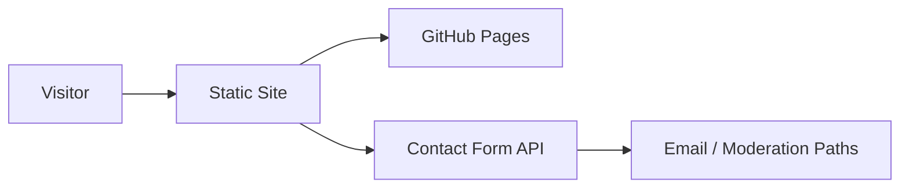

# Architecture

Status: Draft v1
Last updated: 2026-03-20

## Scope

`waterapps-site` is the public marketing website for WaterApps.

It provides:

- company positioning and offer presentation
- buyer-facing content and case-study style material
- browser-submitted contact flows integrated with a separate backend API

## Main Components

1. Static frontend
- HTML, CSS, and JavaScript assets

2. Hosting layer
- GitHub Pages as the current delivery path

3. Contact form integration
- browser posts to the separate `waterapps-contact-form` API

4. Optional edge hardening path
- Cloudflare-based header/security enhancements where GitHub Pages is limited

## Flow

## Boundaries

1. Site content remains separate from backend application logic.
2. Contact handling is delegated to the serverless backend.
3. Response-header hardening may require an edge layer beyond GitHub Pages.

## Risks and Constraints

1. GitHub Pages limits header-level security control.
2. Frontend/contact form behavior depends on backend origin configuration.
3. Public content changes can create brand/legal risk if not reviewed.
