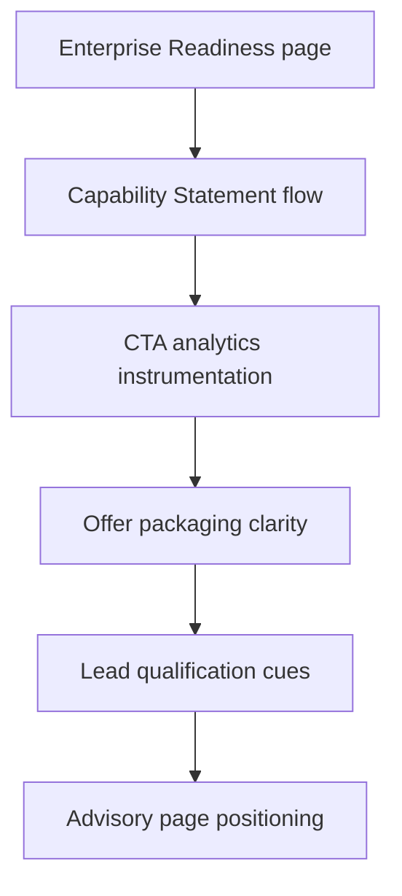

# WaterApps Site Business Risk Mitigation Features

This backlog converts identified business risks into concrete website/productized features for `waterapps-site`.

## Objective

Reduce commercial, legal, operational, and reputation risk while improving conversion quality for enterprise buyers.

## Feature Priorities

1. Enterprise Readiness page (procurement/risk confidence)
2. CTA analytics instrumentation (visibility into conversion failures)
3. Capability statement PDF flow (procurement-friendly asset)
4. Public naming policy + proof policy (consistency)
5. Offer packaging clarity (reduce scope ambiguity)
6. Lead qualification process cues (reduce mismatch)

## Feature 1: Enterprise Readiness Page (High Priority)

### Risk addressed

- Procurement readiness gap
- Compliance overclaim ambiguity
- Trust friction for enterprise buyers

### Deliverable

- New page: `enterprise-readiness.html`
- Homepage/footer links
- Procurement-safe language describing:
  - regulated environment experience
  - security and governance practices
  - insurance and company credentials
  - clearance status / eligibility
  - delivery model (principal-led + specialist network)
  - documentation request path

### Acceptance criteria

- A procurement/risk reviewer can quickly assess baseline suitability
- Wording avoids implied certification or endorsement
- Clear next step for documentation request

## Feature 2: CTA & Contact Analytics Events

### Risk addressed

- Lead capture fragility
- Inability to detect broken paths / low-converting CTAs

### Deliverable

- GA4 events for:
  - discovery call CTA
  - capability statement CTA
  - architecture consult CTA
  - mailto / phone / LinkedIn clicks
  - case study technical section expansions

### Acceptance criteria

- Events visible in GA4 with source labels (`hero`, `mid-page`, `footer`, `contact`)

## Feature 3: Capability Statement Flow

### Risk addressed

- Procurement friction
- Loss of buyers not ready to book a call

### Deliverable

- `capability-statement.html` landing page or direct PDF route
- Temporary PDF placeholder or request-email flow
- CTA placement on homepage and Enterprise Readiness page

### Acceptance criteria

- Works on mobile and desktop
- Provides a procurement-friendly path without forcing a meeting booking

## Feature 4: Public Naming & Proof Policy (Internal + Content Standard)

### Risk addressed

- Reputation risk from inconsistent client naming
- Legal/compliance risk from over-disclosure

### Deliverable

- Internal policy doc (public site repo docs is acceptable)
- Rules for:
  - naming clients on public pages
  - testimonials/recommendations usage
  - evidence requirement for metrics
  - confidentiality-safe wording

### Acceptance criteria

- All new content follows a repeatable naming/proof standard

## Feature 5: Offer Packaging Clarity (Homepage + Advisory Page)

### Risk addressed

- Scope ambiguity
- Low-fit inbound enquiries

### Deliverable

- Clearly define engagement options:
  - Discovery Call
  - Architecture Assessment
  - Platform Advisory / Delivery
- Include typical outputs and timescales

### Acceptance criteria

- Buyers can self-select a suitable next step
- Fewer “not sure what you offer” enquiries

## Feature 6: Lead Qualification Cues (Low-friction)

### Risk addressed

- Message-to-market mismatch
- Time wasted on unqualified calls

### Deliverable

- Add qualification bullets near contact/booking:
  - ideal buyer roles
  - typical engagement triggers
  - project readiness signals

### Acceptance criteria

- Discovery calls skew more qualified

## Recommended Execution Sequence

## Notes

- Pair every new trust/claims feature with the `LEGAL-DO-DONTS.md` checklist.
- Use public/anonymized wording by default unless client naming is intentionally approved.

