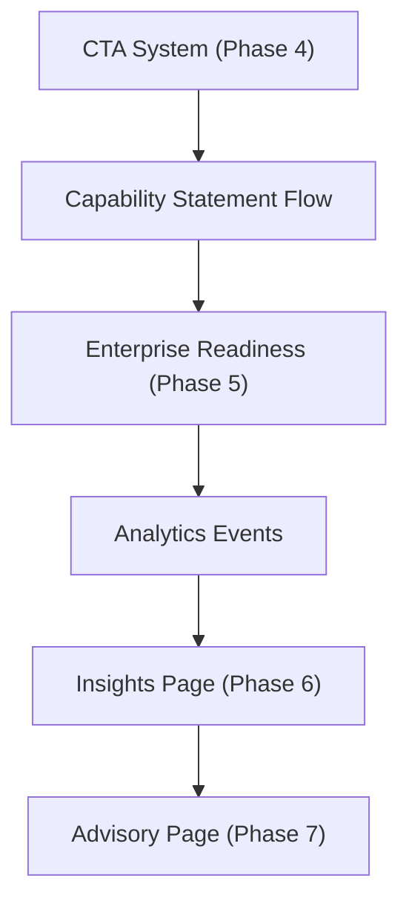

# WaterApps Site Marketing Improvements (Feature Backlog)

This backlog translates the website marketing plan into implementation-ready features for `waterapps-site`.

## Priority Order

1. Phase 4: Conversion Optimization (CTA system)
2. Phase 5: Trust Signal Layer (Enterprise Readiness)
3. Capability Statement download flow
4. Analytics event tracking (CTA + engagement)
5. Insights / Thought Leadership page
6. Architecture Advisory & Platform Strategy page

## Feature 1: 3-Tier CTA System (Phase 4)

### Goal

Increase inquiry conversions without increasing traffic by supporting different buyer intents.

### Scope

- Top-of-page CTA: `Book Discovery Call`
- Mid-page CTA: `Download Capability Statement`
- Bottom-page CTA: `Request Architecture Consult`
- Clear copy variations for executive vs technical buyers

### UI Changes

- Hero CTA remains `Book Discovery Call`
- Add mid-page CTA block after case studies or pricing section
- Contact section CTA block updated with architecture consult option
- Optional sticky CTA on mobile

### Acceptance Criteria

- All 3 CTAs visible on homepage in distinct locations
- Each CTA routes to a working destination
- CTA labels communicate distinct intent (not duplicates)

## Feature 2: Capability Statement Download (Phase 4 support)

### Goal

Capture interest from procurement and buyers who are not ready to book a call.

### Scope (MVP)

- Add `Capability Statement` CTA link/button
- Add placeholder PDF asset or temporary email-request flow
- Add note for procurement teams and enterprise buyers

### Implementation Options

- Option A (fastest): direct link to `capability-statement.pdf`
- Option B: mailto request with prefilled subject
- Option C (later): form + download tracking

### Acceptance Criteria

- CTA visible on homepage mid-page
- Download/request path works on desktop and mobile

## Feature 3: Enterprise Readiness Section/Page (Phase 5)

### Goal

Reduce procurement friction and establish trust before first contact.

### Scope

Add `Enterprise Readiness` section (homepage) and/or dedicated page containing:

- compliance frameworks worked under (e.g. APRA, PCI DSS)
- clearance status / eligibility (Baseline, NV1 eligible)
- industries served
- security practices
- delivery model (direct + specialist network)
- insurance and business verification references

### Suggested Structure

- Summary strip (trust bullets)
- Compliance & governance
- Security & delivery controls
- Procurement support
- Documentation request CTA

### Acceptance Criteria

- A procurement or risk reviewer can quickly assess baseline suitability
- Confidentiality-safe wording is used

## Feature 4: Analytics Event Tracking (CRO Instrumentation)

### Goal

Measure which CTAs and sections drive qualified engagement.

### Scope

Track events for:

- `Book Discovery Call` clicks
- `Download Capability Statement` clicks
- `Request Architecture Consult` clicks
- `mailto:` clicks
- phone clicks
- LinkedIn clicks
- case-study technical `
` expands

### Implementation Notes

- Use existing `gtag` setup
- Add simple `onclick` or delegated JS event tracking
- Name events consistently (e.g. `cta_click`, `contact_click`, `case_study_expand`)

### Acceptance Criteria

- Events appear in GA4 for all primary CTAs
- Event labels identify source section and CTA type

## Feature 5: Insights / Thought Leadership Page (Phase 6)

### Goal

Support weekly publishing cadence and inbound search visibility.

### Scope (MVP)

- New page: `/insights.html` (or equivalent static page)
- List of article summaries/cards
- “Coming weekly” placeholder entries acceptable for MVP
- Link from homepage nav/footer

### Future Scope

- Individual article pages
- tag/category filters
- RSS feed

### Acceptance Criteria

- Dedicated insights page exists and is linked in nav/footer
- Supports publishing at least 4 initial articles

## Feature 6: Architecture Advisory & Platform Strategy Page (Phase 7)

### Goal

Shift perception from implementation-only consultant to strategic architecture advisor.

### Target Audience

- CTO
- Head of Platform
- Chief Architect

### Scope

New page focused on strategic outcomes:

- platform strategy
- operating model design
- modernization roadmap sequencing
- risk/compliance-aware architecture decisions
- advisory engagement models

### Acceptance Criteria

- Page avoids developer-level tool-first messaging
- Speaks to decision-makers and transformation owners
- Includes CTA to request architecture consult

## Delivery Sequence (Recommended)

## Release Strategy

- Release 1: CTA system + capability statement CTA
- Release 2: Enterprise readiness section/page
- Release 3: Analytics instrumentation
- Release 4: Insights page
- Release 5: Advisory page

## Notes

- Keep public case studies anonymized unless explicit client naming permission exists.
- Use resume-backed facts for all metrics and technical claims.
- Favor incremental static HTML changes first; migrate to a richer site stack later only if content velocity or maintainability demands it.
- Apply UI acceptance criteria from `docs/WEBSITE_UI_QUALITY_STANDARD.md` for all significant page changes.
